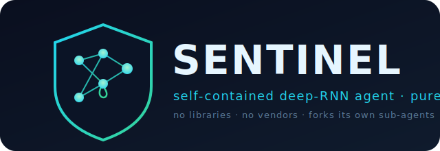
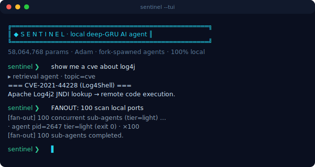
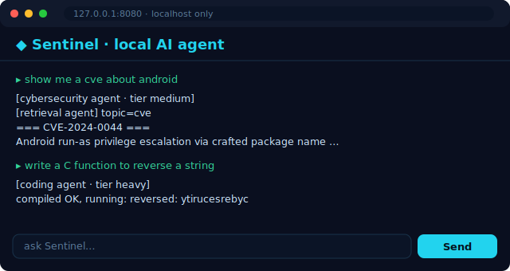

<p align="center">
  
</p>

<p align="center">
  <a href="LICENSE"></a>
  
  
  <a href="https://github.com/mattmorris-dev/Sentinel/releases"></a>
  
  
  <br>
  <a href="https://github.com/mattmorris-dev/Sentinel/stargazers"></a>
  <a href="https://github.com/mattmorris-dev/Sentinel/network/members"></a>
  <a href="https://github.com/mattmorris-dev/Sentinel/issues"></a>
</p>

# Sentinel — your security analyst that never leaves the box

<sub>by **Pr0xy_22**</sub>

**A self-contained AI security agent in one C file. No cloud. No API keys. No vendor.
No per-token bill.** It runs on a $50 Raspberry Pi, answers CVE / malware / OSINT
questions from real data, and spawns its own sub-agents to do the work — entirely on
your machine.

```sh
git clone https://github.com/mattmorris-dev/Sentinel && cd Sentinel
make && ./start.sh
```

> Built for the people cloud AI shuts out: **air-gapped networks, incident responders,
> privacy-first teams, home labs, classrooms.** You compile one file and own the binary
> forever. (See [`PITCH.md`](PITCH.md) for the short version.)

## What it does

- 🛡️ **Answers security questions from real data.** Ask `show me a cve about log4j` or
  `malware like emotet` and it greps a local corpus of **150k+ CVE writeups, malware-
  analysis notes, and OSINT resources** — with optional **live internet** lookup for
  fresh CVEs (`SLM_ONLINE=1`). Knowledge lives in the corpus (retrieval / RAG), which
  is how the model stays small.
- 🤖 **Spawns its own sub-agents.** `TASK:` forks a specialist worker
  (cybersecurity / coding / general); `FANOUT: 100` runs up to a hundred at once, each
  sized to the task's difficulty.
- 🧠 **A real neural net, by hand.** A stacked **GRU** with backprop-through-time and
  **Adam** — no libraries, just libc + libm — that keeps learning from what it reads.
- 🔒 **Safe by default.** Every command is screened (no `sudo`, no destructive ops); the
  web UI binds to localhost only; `SLM_NO_EXEC=1` makes it plan-only.
- 🖥️ **However you like it.** Web GUI (`--serve`), terminal UI (`--tui`), plain CLI, or a
  single sub-agent call.

## Runs on what you've got — pick a size

| Build | Params | RAM | Flag | Hardware |
|---|---|---|---|---|
| `make slm` | ~1.2M | 27 MB | none | a potato |
| `make` (default) | ~58M | ~1.9 GB | none (plain gcc) | a Pi 4 / any laptop |
| `make huge` | ~101M | ~3.2 GB | `-mcmodel=large` | an 8 GB Pi / a server |

It's a genuine deep network with real weights, gradients, and GRU backprop — built by
hand in standard C. It learns character/word statistics (not fluent prose); the power is
the **complete, dependency-free, fully local pipeline**: tokenizer → embedding → stacked
GRU → BPTT/Adam → checkpointing → retrieval → process-spawning agents.

## See it run

```sh
./demo.sh    # builds the tiny SLM, grabs a small corpus, runs a scripted showcase
```

Real output (a CVE lookup, a coding agent that *compiles and runs C*, and a fan-out of
concurrent workers — all local):

```text
[trigger detected] spawning sub-agent (tier=medium) for: "show me a cve about http"
  ┌─ sub-agent pid=2112  specialism=CYBERSECURITY  tier=medium (param-budget≈512K, 8s cap)
  │  [retrieval agent] topic=cve  searching corpus for: http
  │  === corpus/cve_famous/CVE-2023-44487.md ===
  │  ### [CVE-2023-44487]
  │  ### Description
  │  The HTTP/2 protocol allows a denial of service (server resource consumption) because
  │  request cancellation can reset many streams quickly, as exploited in the wild ...
  └─ sub-agent pid=2112 finished (exit 0)

[trigger detected] spawning sub-agent (tier=heavy) for: "write a C function to reverse a string"
  ┌─ sub-agent pid=2630  specialism=CODING  tier=heavy (param-budget≈4096K, 20s cap)
  │  [coding agent] compiled OK, running:
  │  reversed: ytirucesrebyc
  └─ sub-agent pid=2630 finished (exit 0)

[fan-out] launching 12 concurrent sub-agents (tier=light) for: "report current date"
  · agent pid=2647 tier=light ... (exit 0)        ·  (×12, all concurrent)
[fan-out] 12 sub-agents completed.
```

### Interfaces

| Terminal UI (`./sentinel --tui`) | Web GUI (`./sentinel --serve 8080`) |
|---|---|
|  |  |

> _Mockups above; for real screenshots, run `./sentinel --tui` / `./sentinel --serve 8080`
> and replace `assets/tui.svg` / `assets/gui.svg`. Both are pure-C, dependency-free, and
> 100% local (the GUI binds to 127.0.0.1 only)._

## Build

```sh
gcc -O2 -Wall -o sentinel main.c -lm
```

…or use the Makefile:

```sh
make            # build the big model (./sentinel)
make slm        # build a small ~1.2M-param SLM (./sentinel-slm, plain gcc)
make both       # build BOTH
make quick-fetch && make train   # fetch a demo corpus and train on it
make run        # train on the built-in corpus, then serve the agent loop
make install    # install to /usr/local/bin (PREFIX overridable)
make package    # build a source release tarball
make help       # list all targets
```

## Run

```sh
# Train on the built-in corpus, print the loss curve + a sample, then serve.
# Plain text on stdin -> online learning. Lines with "TASK:" -> spawn a sub-agent.
printf 'TASK: list files in this directory\nTASK: write a C function to reverse a string\n' | ./sentinel
```

Other modes:

```sh
./sentinel --agent "<task>"           # run directly as a single sub-agent
./sentinel --train corpus.txt         # absorb one corpus file, then checkpoint
./sentinel --train ./data             # consolidate a WHOLE directory tree
./sentinel --train a.txt b.md ./src   # consolidate several files + dirs at once
./sentinel --tui                      # styled terminal UI (agent console)
./sentinel --serve 8080               # web GUI at http://127.0.0.1:8080 (localhost only)
```

### Interfaces: TUI and web GUI

- **`./sentinel --tui`** — a colored, framed terminal console for typing tasks,
  `FANOUT:` batches and CVE questions interactively.
- **`./sentinel --serve [port]`** — a tiny built-in HTTP server (pure C sockets,
  no dependencies) serving a chat-style web page. It **binds to 127.0.0.1 only**
  because agents run real shell commands — do not expose it to a network.

### Data consolidation (feed the bigger net more data)

`--train` accepts any mix of files and directories. Directories are walked
recursively and every text/code file (`.txt .md .c .h .py .js .json .csv .html
.java .rs .go .sh …`) is folded into **one** training corpus before training
(dotfiles and `.git` are skipped; total capped at 64 MB). More parameters only
help if they have more data to learn from — this is how you supply it:

```sh
SLM_EPOCHS=20000 ./sentinel --train ./my_notes ./some_repo/src
```

### Fetch real-world data: `fetch_corpus.sh`

To train on real security + coding knowledge and live CVE data, the included
`fetch_corpus.sh` clones a curated set of **high-starred, free, open-source**
GitHub repositories plus public CVE writeups into `./corpus`, then you train on
the whole pile. It is **100% free and vendor-neutral** — only `git` + `curl`,
no API keys, no paid services, no Claude or any other vendor dependency, and the
training runs fully offline afterwards.

```sh
QUICK=1 ./fetch_corpus.sh        # small/fast demo: famous CVEs + a couple repos
./fetch_corpus.sh                # full corpus (several repos + recent CVE years)
CVE_YEARS="2022 2023 2024 2025" ./fetch_corpus.sh
./sentinel --train corpus       # consolidate + train on everything fetched
```

Sources are grouped in editable arrays at the top of the script:
- **Security:** OWASP Cheat Sheets, PayloadsAllTheThings, the-book-of-secret-knowledge
- **Coding:** TheAlgorithms (C and Python)
- **Neural-net reference:** micrograd, char-rnn, nanoGPT (so it can also learn the
  code of models like itself)
- **CVE data:** `trickest/cve` — 150k+ real vulnerability writeups (Log4Shell, xz
  backdoor, Heartbleed, …), pulled per-year via sparse checkout so it stays bounded

Add any repo you like to those lists.

### Difficulty-tiered sub-agent fan-out

Each task is auto-assigned a **difficulty tier** — `light` / `medium` / `heavy` —
from its length and keywords, which sets the agent's compute/parameter budget
(easy tasks get a smaller budget and a shorter time cap). You can fan out **up to
100 sub-agents concurrently**:

```sh
TASK: list files in this directory          # one agent, tier auto-detected
FANOUT: 100 scan local network ports        # 100 concurrent agents
```

Sub-agents are cheap because re-exec'ing into `--agent` mode never allocates the
big GRU weight arrays (demand-zero memory stays untouched), so 100 of them use a
few hundred MB total, not 100×1 GB. The big model is the orchestrator; the workers
are lightweight and difficulty-scaled.

## Architecture (where the depth lives)

```
token --> [embedding] --> [GRU layer 0] --> [GRU layer 1] --> ... --> [softmax] --> next char
                               ^  |              ^  |
                               +--+ hidden state +--+ hidden state   (fed back every step)
```

## Growing the network's skills

- **Deepen / widen it:** edit the hyperparameters at the top of `main.c`
  (`NUM_LAYERS`, `HIDDEN`, `EMBED`, `SEQ_LEN`) and recompile. The layer code is
  dimension-generic, so nothing else needs to change. (Changing the architecture
  starts a fresh checkpoint automatically — the old one records its own dims.)
  The default build is **3 GRU layers, HIDDEN=2368, EMBED=128 ≈ 101M parameters** (~3.2 GB RAM,
  ~32 bytes/param with Adam). Note: >2 GB of static arrays needs `-mcmodel=large`; raising `HIDDEN`/`NUM_LAYERS` scales the parameter count roughly
  with `NUM_LAYERS * HIDDEN²`. `VOCAB` must stay a power of two (128 = ASCII, or
  256 for full-byte / UTF-8-bytes) because the tokenizer masks with `VOCAB-1`.
- **Teach it more:** `./sentinel --train yourtext.txt`, or just pipe text in on
  stdin during the read loop. Both persist into `sentinel.bin`.
- **Train longer:** `SLM_EPOCHS=20000 ./sentinel`.

## Safety

Sub-agents run real shell commands **autonomously**, but every command is screened
by a hard guard (`is_command_safe`) that **refuses `sudo`** and a denylist of
destructive/privileged patterns (`rm -rf /`, `mkfs`, `dd of=`, fork bombs,
`shutdown`/`reboot`, pipe-to-shell from the network, reads of `/etc/shadow`, …).
Set `SLM_NO_EXEC=1` to force **plan-only** mode (prints the command it *would* run,
executes nothing) as a global kill switch — no recompile needed.

## Free vs Pro

**This repo is Sentinel Core — free and open, build it yourself.** A commercial
**Sentinel Pro** (ready-to-flash Pi image, pretrained large model, auto-updating threat
feeds, dashboard + reporting, support) is available for those who'd rather not build and
maintain it themselves — see **[`PRO.md`](PRO.md)**.

## License

Released under the [Apache License 2.0](LICENSE) — free to use, modify, and
distribute (including commercially), with an explicit patent grant. No warranty.
Fully self-contained and vendor-neutral. (Sentinel Pro is a separate commercial offering.)
